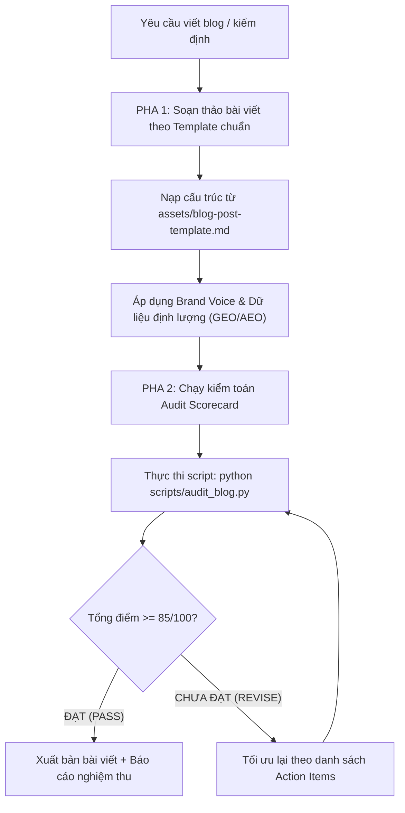

# Kỹ Năng Viết Bài Blog & Kiểm Định Trước Khi Đăng (SEO, AEO, GEO)

Tài liệu này định hình tiêu chuẩn viết và kiểm toán bài viết blog chuyên nghiệp của doanh nghiệp, giúp mọi bài viết vừa đạt thứ hạng cao trên Google truyền thống (SEO), vừa được các công cụ tìm kiếm câu trả lời chọn làm đoạn trích nổi bật (AEO), và vừa được các mô hình AI thế hệ mới trích dẫn nguồn uy tín trong AI Overviews (GEO).

---

## 🧭 Ma Trận Phân Biệt SEO vs AEO vs GEO

| Tiêu chí | SEO (Google truyền thống) | AEO (Answer Engine: Perplexity, SearchGPT) | GEO (Generative Engine: Google AI Overviews) |
| :--- | :--- | :--- | :--- |
| **Mục đích** | Đưa link website lên top 1-10 trang kết quả tìm kiếm. | Trở thành câu trả lời trực tiếp dứt khoát cho người dùng. | Trở thành nguồn dữ liệu được mô hình AI tổng hợp và trích dẫn footnote. |
| **Đơn vị tối ưu** | Trang web, URL, thẻ Heading, mật độ từ khóa. | Hộp trả lời ngắn (40-60 từ), cặp câu hỏi/đáp (Q&A). | Thực thể khoa học (Entities), số liệu định lượng, bảng so sánh dữ liệu. |
| **Người đọc chính**| Bọ tìm kiếm (Googlebot) & Người dùng click web. | AI Agents, Trợ lý giọng nói (Siri, Alexa), Chatbots. | Mô hình ngôn ngữ lớn (LLMs: Gemini, GPT-4, Claude). |

---

## 🔄 Quy Trình Vận Hành 2 Pha Bắt Buộc

Khi nhận được yêu cầu viết bài hoặc kiểm tra bài blog, Claude phải thực hiện tuần tự theo quy trình:



### Pha 1: Soạn Thảo Bài Viết Chuẩn Cấu Trúc
1. **Metadata đầy đủ:** Frontmatter chứa `title`, `meta_title`, `meta_description` (140-160 ký tự), `focus_keyword`, `secondary_keywords`.
2. **Khối AEO Direct Answer (Bắt buộc):** Đặt ngay dưới H1 trong khung trích dẫn `> **Tóm tắt câu trả lời (40-60 từ):** ...` trả lời trực diện câu hỏi của bài.
3. **Phân cấp Heading chuẩn mực:** 1 thẻ H1 duy nhất, ít nhất 3 thẻ H2 (có chứa từ khóa hoặc biến thể), các thẻ H3 logic.
4. **Khối GEO Data Matrix (Bắt buộc):** Ít nhất 1 bảng biểu Markdown so sánh thông số, cơ chế hoặc dữ liệu định lượng.
5. **Khối FAQ Schema (Bắt buộc):** Tối thiểu 3-5 câu hỏi thường gặp dạng `Q:` và `Trả lời:` ngắn gọn (40-50 từ/câu).
6. **Tuân thủ Brand Voice:** Câu ngắn, thẳng thắn, không dùng từ sáo rỗng (*thần dược*, *cam kết 100%*, *đột phá vĩ đại*...).

### Pha 2: Tự Động Kiểm Định & Chấm Điểm
Chạy công cụ kiểm toán Python tích hợp sẵn:
```bash
python scripts/audit_blog.py path/to/bai-viet.md --keyword "từ khóa chính"
```
Hoặc đối chiếu thủ công với bảng checklist tại `assets/seo-aeo-geo-checklist.md`.  
**Điều kiện xuất bản:** Bài viết phải đạt $\ge 85/100$ điểm. Nếu dưới 85 điểm, phải bổ sung các đề xuất trong phần **ACTION ITEMS** trước khi bàn giao cho người dùng.

---

## 📊 Thang Điểm Kiểm Định 100 Điểm Chi Tiết

### 1. Trụ Cột SEO Truyền Thống (30 Điểm)
- **SEO-01 (5đ):** H1/Title chứa từ khóa chính, độ dài 50-70 ký tự.
- **SEO-02 (5đ):** Meta description 140-160 ký tự, chứa từ khóa chính và lời kêu gọi click.
- **SEO-03 (5đ):** Cấu trúc Heading mạch lạc (1 H1, $\ge 3$ H2, có H2 chứa từ khóa).
- **SEO-04 (5đ):** Từ khóa xuất hiện trong 150 từ đầu tiên, mật độ toàn bài đạt 0.8% - 2.5%.
- **SEO-05 (5đ):** Độ dài bài viết đạt $\ge 1.200$ từ (đảm bảo chiều sâu nội dung).
- **SEO-06 (5đ):** Có ít nhất 2 liên kết nội bộ/ngoại và vị trí đặt hình ảnh có Alt text chuẩn SEO.

### 2. Trụ Cột AEO - Answer Engine Optimization (30 Điểm)
- **AEO-01 (10đ):** Direct Answer Box 40-60 từ ở đầu bài trả lời thẳng vào trọng tâm tìm kiếm.
- **AEO-02 (8đ):** Định nghĩa trực diện (Definition capsule) 1-2 câu đầu dưới các thẻ H2 chính.
- **AEO-03 (8đ):** Khối FAQ cấu trúc rõ ràng với $\ge 3$ câu hỏi đáp thường gặp súc tích.
- **AEO-04 (4đ):** Cấu trúc danh sách liệt kê (bullet points, numbered steps) rõ ràng cho AI đọc thành tiếng.

### 3. Trụ Cột GEO - Generative Engine Optimization (30 Điểm)
- **GEO-01 (8đ):** Mật độ thực thể định danh cao (tên thành phần khoa học, chuẩn kiểm định, cơ chế sinh học).
- **GEO-02 (8đ):** Dữ liệu định lượng phong phú ($\ge 5-10$ số liệu cụ thể: %, mg, độ tuổi, năm nghiên cứu).
- **GEO-03 (8đ):** Bảng dữ liệu Markdown so sánh trực quan (LLMs cực kỳ ưu tiên trích xuất bảng).
- **GEO-04 (6đ):** Trích dẫn nguồn nghiên cứu, cơ quan kiểm định hoặc tiêu chuẩn sản xuất uy tín (GMP Nhật Bản, Bộ Y tế).

### 4. Trụ Cột Brand Voice & Trải Nghiệm Đọc (10 Điểm)
- **BV-01 (4đ):** Câu văn gãy gọn, trung bình $\le 22$ từ/câu, không viết đoạn dài lê thê.
- **BV-02 (4đ):** Không chứa từ sáo rỗng hoặc thuật ngữ PR giả tạo (trừ 2đ/từ cấm nếu vi phạm).
- **BV-03 (2đ):** Lời kêu gọi hành động (CTA) chân thành, thực tế, hướng đến giải pháp bền vững cho độc giả.

---

## 📁 Tài Nguyên Kèm Theo (Assets & Scripts)

- **Template mẫu bài blog:** `assets/blog-post-template.md` (Khung sườn chuẩn hóa mọi bài viết).
- **Bảng checklist chi tiết:** `assets/seo-aeo-geo-checklist.md` (Bảng tiêu chí và hướng dẫn chấm điểm).
- **Script kiểm toán tự động:** `scripts/audit_blog.py` (Tool Python quét bài viết và in báo cáo).

---

## 🛠️ Xử Lý Tình Huống Ngoại Lệ (Troubleshooting & Edge Cases)

1. **Khi bài viết bị điểm AEO thấp (< 20đ):**
   - *Nguyên nhân:* Mở bài lan man dài dòng, bắt đầu H2 bằng các câu đưa đẩy dẫn dắt, thiếu mục FAQ.
   - *Khắc phục:* Viết ngay 1 hộp `> **Tóm tắt câu trả lời (40-60 từ):** ...` đặt dưới H1; gọt giũa câu đầu tiên dưới mỗi H2 thành 1 câu định nghĩa dứt khoát.

2. **Khi bài viết bị điểm GEO thấp (< 20đ):**
   - *Nguyên nhân:* Toàn bộ bài viết là các nhận định chung chung (ví dụ: "rất hiệu quả", "tăng trưởng vượt trội"), không có con số cụ thể.
   - *Khắc phục:* Thay các tính từ sáo rỗng bằng con số chính xác (ví dụ: thay vì "hấp thu tốt hơn", hãy viết "hấp thu cao hơn gấp 3-5 lần nhờ kích thước hạt nano dưới 100nm"); bổ sung ngay 1 bảng so sánh đối chiếu Markdown.

3. **Khi bài viết dính cảnh báo Brand Voice (BV-02):**
   - *Nguyên nhân:* Chứa các từ hoa mỹ như "thần dược", "cam kết 100%", "đột phá vĩ đại".
   - *Khắc phục:* Xóa bỏ hoàn toàn và thay thế bằng bằng chứng thực nghiệm khoa học và quy chuẩn kiểm định thực tế.
